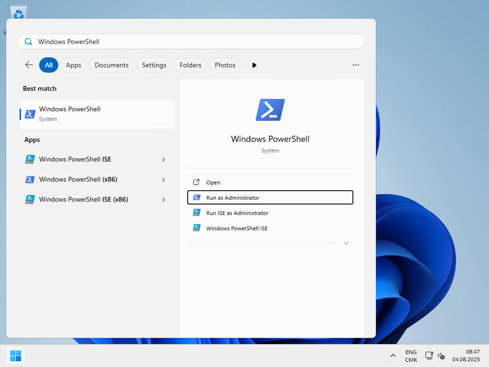
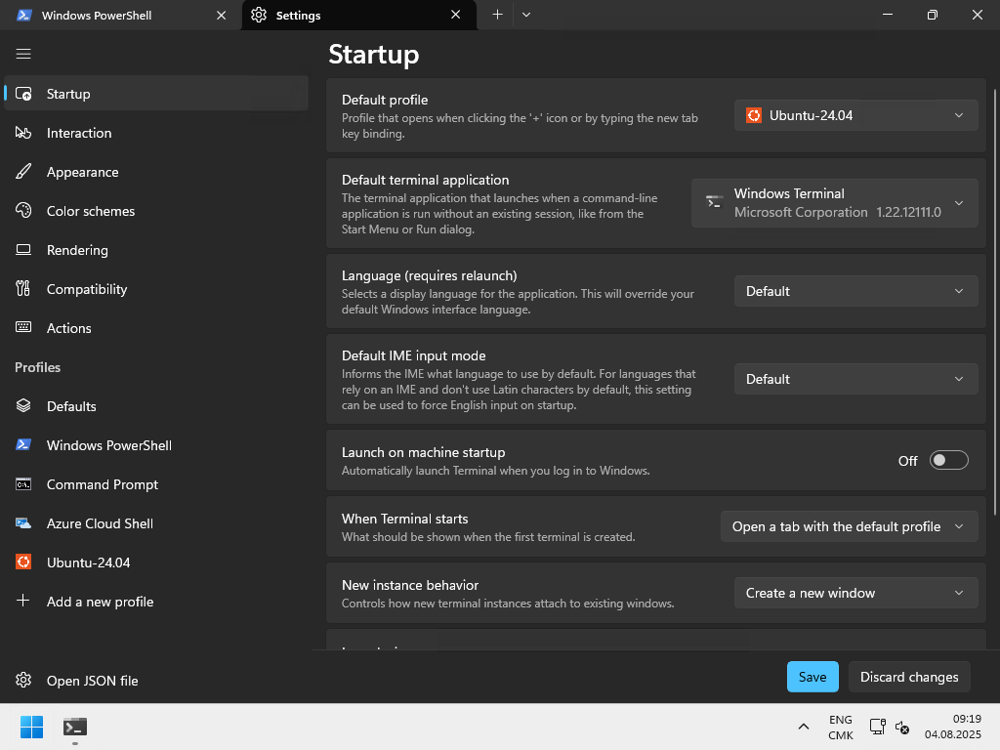
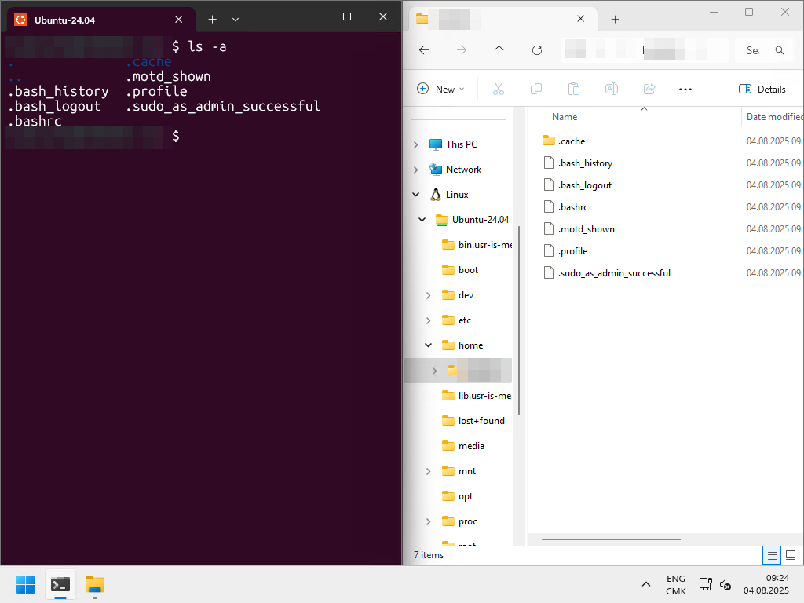
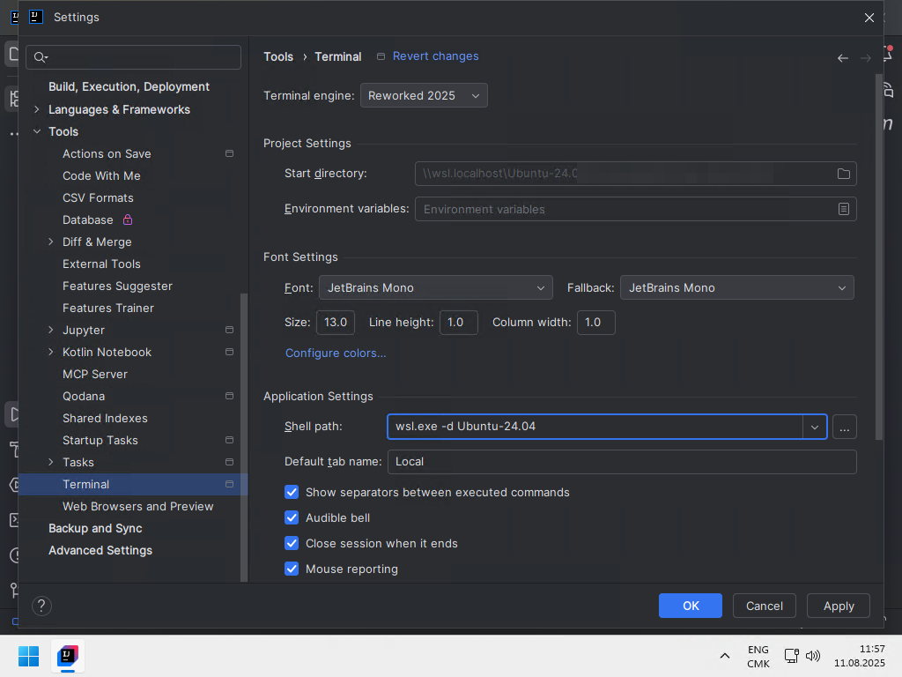

Before the semester starts, you will install everything the course relies
on: a Unix environment (WSL for Windows users), Git and a GitHub account,
Java and Maven, and IntelliJ IDEA.

Every step ends with a **verification command**. If all verifications pass,
you are ready. If you get stuck, check the troubleshooting boxes first,
then ask us — we will also take a moment during the first course for
remaining problems.

::: {.callout-note}
Estimated time: 1–2 hours on Windows (WSL setup included), ~30 minutes on
macOS or Linux.
:::

## macOS only: install Homebrew

::: {.callout-note}
On **Windows**, skip to [Install WSL](#windows-only-install-wsl); on
**Linux**, skip to [Terminal basics](#terminal-basics) — `apt` already
covers this.
:::

[Homebrew](https://brew.sh) is the de-facto package manager for macOS —
the equivalent of Ubuntu's `apt`: it installs, updates and removes
developer tools cleanly. You will use it to install the course tooling
(starting with Git below).

Install it by following the instructions on <https://brew.sh> (one
command), and **follow the "Next steps" the installer prints** at the end
— they add `brew` to your shell's PATH.

**Verification**: open a new terminal; `brew --version` prints a version.

## Windows only: install WSL

::: {.callout-note}
On **macOS or Linux**, skip to [Terminal basics](#terminal-basics).
:::

Software development on Windows is harder than on Linux or macOS. The
Windows Subsystem for Linux (WSL) gives you a real Linux environment inside
Windows — you will use it for the whole semester: **every command in this
course runs in the Ubuntu terminal**, no other environment (Git Bash,
Cygwin, …) is supported.

### Install WSL and Ubuntu

First make sure Windows is up to date (**Settings > Windows Update**),
then open PowerShell **as administrator**:

{width="60%"}

```powershell
# Install WSL (skip if this prints the help message instead)
wsl --install --no-distribution
```

Restart your computer, then in an administrator PowerShell again:

```powershell
# Update WSL and set version 2 as default
wsl --update --web-download
wsl --set-default-version 2

# List available distributions, then install the latest Ubuntu LTS
# version shown in YOUR list (marked "LTS", e.g. Ubuntu-26.04 — use the
# versioned entry, not the unversioned "Ubuntu" one)
wsl --list --online
wsl --install --distribution Ubuntu-<latest-LTS-version>
```

You will be asked to create a username and password for Ubuntu (we suggest
the same as your Windows account).

::: {.callout-tip}
When typing your password, **nothing appears on screen** — that is normal
terminal behavior. Your keystrokes are registered; remember this password,
`sudo` will ask for it.
:::

Finally, update Ubuntu from its terminal:

```sh
sudo apt update && sudo apt upgrade
```

::: {.callout-tip title="What did I just type?"}
- `sudo` runs a command with superuser privileges — Linux asks for
  **your** password (typed invisibly) before allowing it. That is why
  installs and system updates start with it.
- `apt` is Ubuntu's **package manager**: it installs, updates and removes
  software from a curated catalog — `apt update` refreshes the catalog,
  `apt upgrade` updates your installed packages. You will use it all
  semester. (Windows has equivalents — see [Go further](#go-further).)
:::

### Make Ubuntu your default terminal

Install [Windows Terminal](https://www.microsoft.com/p/windows-terminal/9n0dx20hk701)
from the Microsoft Store if not already present, open its **Settings** and
set:

- **Default profile**: `Ubuntu-<your-version>`
- **Default terminal application**: Windows Terminal

{width="80%"}

Close and reopen Windows Terminal: it should drop you into Ubuntu.

::: {.callout-tip}
You can still open a PowerShell tab anytime via the **down arrow** in the
title bar — and holding `Ctrl` while selecting *Windows PowerShell* opens
it **as administrator**. You will need that for the next steps.
:::

### Where your files live

When you open the Ubuntu terminal, you land in the **home directory** of
your Ubuntu user, located under `/home` and usually written `~` — the `~`
symbol is a shorthand for your home directory. This is where **all your
projects go**.

The two worlds can see each other:

- From Ubuntu, your Windows drives are mounted under `/mnt` — e.g.
  `C:\Users` is `/mnt/c/Users`.
- From Windows, your Ubuntu home is reachable in the File Explorer at
  `\\wsl.localhost\Ubuntu-<version>\home\<user>`:

{width="70%"}

::: {.callout-caution}
**Never manipulate project files from the Windows File Explorer.** Always
use the Ubuntu terminal (or your IDE). Mixing the two causes permission
issues and odd file behaviors that are painful to debug.
:::

### Exclude WSL from Windows Defender

This dramatically improves WSL performance and prevents known issues with
IntelliJ. In an administrator PowerShell:

```powershell
Add-MpPreference -ExclusionPath '\\wsl.localhost\Ubuntu-<your-version>'
```

(If you use another antivirus, exclude the same path in its settings.)

**Verification**: open Windows Terminal — it opens Ubuntu directly, and
`cat /etc/os-release` prints your Ubuntu version.

::: {.callout-important collapse="true" title="WSL troubleshooting"}
- **Error 403 during install/update**: your network blocks the download —
  try another network (e.g. phone hotspot).
- **WSL not available**: check your Windows version (WSL needs Windows 10
  1607+): `systeminfo | Select-String "^OS Name","^OS Version"`.
- **Required features**: in an administrator PowerShell:
  ```powershell
  dism.exe /online /enable-feature /featurename:Microsoft-Windows-Subsystem-Linux /all /norestart
  dism.exe /online /enable-feature /featurename:VirtualMachinePlatform /all /norestart
  ```
- **Virtualization disabled**: reboot into BIOS/UEFI
  (`shutdown /r /fw` in an administrator PowerShell) and enable
  "Virtualization" / "VT-x" / "AMD-V".
:::

## Terminal basics

You will live in the terminal this semester. Make sure these commands feel
familiar (`man <command>` shows the manual of any command):

```sh
ls                    # list files and directories
cd <dir>  /  cd ..    # change directory / go to parent
pwd                   # print the working directory
touch <file>          # create an empty file
mkdir <dir>           # create a directory
rm <file>  /  rm -r <dir>   # remove a file / a directory
cp <src> <dst>        # copy (add -r for directories)
mv <src> <dst>        # move or rename
cat <file>            # print the content of a file
less <file>  /  more <file>  # page through a file (q to quit)
tail <file>           # print the last lines (-f to follow live, e.g. logs)
exit                  # exit the terminal session
```

**Verification**: create a directory, create a file in it, list it, delete
both — without touching the mouse.

## Git and GitHub

Git is the version control system used everywhere in this course, starting
week 1.

::: {.panel-tabset}

### Ubuntu / WSL

```sh
sudo apt install git
```

### macOS

```sh
# Via Homebrew — macOS ships a Git with the Apple developer tools, but
# it is usually several versions behind; prefer Homebrew's up-to-date one
brew install git
```

:::

Then introduce yourself to Git (used to sign your commits' metadata):

```sh
git config --global user.name "First-name Last-name"
git config --global user.email "your.email@example.com"
```

Finally, create a [GitHub account](https://github.com/signup) if you do
not have one yet — use an email address you keep after your studies; you
will build a portfolio on it.

**Verification**: `git --version` prints a version, and you can log in on
github.com.

## Java and Maven, via SDKMAN!

[SDKMAN!](https://sdkman.io/) manages Java toolchain versions — it lets
you install and switch between several Java versions cleanly.

Install it by following the instructions on <https://sdkman.io/> (one
`curl` command), then open a **new** terminal.

::: {.callout-tip}
If SDKMAN! complains about missing packages on Ubuntu/WSL, install them
with `sudo apt install <package>` and retry.
:::

Then install the latest LTS Java (Temurin distribution) and Maven:

```sh
# Find the latest LTS Temurin version (25.x.y-tem at the time of writing)
sdk list java

# Install it (replace with the identifier from YOUR list)
sdk install java <version>-tem

# Install Maven
sdk install maven
```

**Verification**:

```sh
sdk version       # prints the SDKMAN! version
java --version    # prints Temurin 25 (or newer LTS)
mvn --version     # prints Maven, running on that Java
```

## IntelliJ IDEA

IntelliJ IDEA is the supported IDE for this course (any edition — we use
no Ultimate-only feature; other IDEs are allowed but unsupported).

1. Optional: activate the free
   [JetBrains student license](https://www.jetbrains.com/community/education/#students)
   with your HEIG-VD email.
2. Install the [JetBrains Toolbox App](https://www.jetbrains.com/toolbox/app)
   (on Windows: install it **on Windows**, not in WSL).
3. From the Toolbox App, install **IntelliJ IDEA** (Community or Ultimate).

::: {.callout-important collapse="true" title="Windows only: connect IntelliJ to WSL"}
Allow IntelliJ to reach WSL through the Windows Firewall — in an
administrator PowerShell:

```powershell
# Allow WSL through the firewall
New-NetFirewallRule -DisplayName "WSL" -Direction Inbound -InterfaceAlias "vEthernet (WSL (Hyper-V firewall))" -Action Allow

# Refresh IntelliJ's own firewall rules
Get-NetFirewallProfile -Name Public | Get-NetFirewallRule | where DisplayName -ILike "IntelliJ IDEA*" | Disable-NetFirewallRule
```

Two rules to respect for the whole semester:

- **Create all projects in your WSL home directory**
  (`\\wsl.localhost\Ubuntu-<version>\home\<user>`), never on the Windows
  side.
- IntelliJ's built-in terminal should open WSL. If it opens PowerShell
  instead: **Settings > Tools > Terminal**, set the shell path to
  `wsl.exe -d Ubuntu-<your-version>`:

{width="80%"}

If IntelliJ cannot find Java/Maven in WSL, verify the Windows Defender
exclusion from the WSL section — it is a
[known blocker](https://youtrack.jetbrains.com/issue/IDEA-273533/Impossible-to-configure-SDK-on-windows-with-WSL).
:::

**Verification**: create a throwaway project in IntelliJ — it detects your
Java 25 installation (on Windows: from WSL), and its terminal opens your
Unix shell.

## Final checklist

You are ready for the first course when every line passes:

| Check | Command / action |
|-------|------------------|
| Unix terminal available | Windows: Windows Terminal opens Ubuntu · macOS/Linux: any terminal |
| Basic commands mastered | create/list/delete files and directories without the mouse |
| Package manager | Ubuntu/WSL: `apt --version` · macOS: `brew --version` |
| Git installed and configured | `git --version` · `git config user.name` prints your name |
| GitHub account | you can log in on github.com |
| SDKMAN! | `sdk version` |
| Java LTS | `java --version` shows Temurin 25+ |
| Maven | `mvn --version` |
| IntelliJ IDEA | new project detects Java (Windows: from WSL) |

## Go further

::: {.callout-note collapse="true" title="A package manager for Windows"}
Ubuntu's `apt` has Windows equivalents:
[WinGet](https://learn.microsoft.com/windows/package-manager/),
[Chocolatey](https://chocolatey.org/), [Scoop](https://scoop.sh/) — not
required for the course, but handy.
:::

::: {.callout-note collapse="true" title="Reclaim WSL disk space"}
WSL's virtual disk grows but never shrinks by itself. In an administrator
PowerShell:

```powershell
wsl --shutdown
wsl --manage Ubuntu --set-sparse true
```
:::

## Sources

- O. Tischhauser, with the help of
  [Claude](https://claude.com) (Anthropic).
- Adapted from the
  [HEIG-VD DAI course](https://github.com/heig-vd-dai-course/heig-vd-dai-course)
  by L. Delafontaine and H. Louis, licensed
  [CC BY-SA 4.0](https://creativecommons.org/licenses/by-sa/4.0/)
  (chapters *Set up a Windows development environment* and *Java, IntelliJ
  IDEA and Maven*).
- [How to install Linux on Windows with WSL](https://learn.microsoft.com/windows/wsl/install) — Microsoft.
