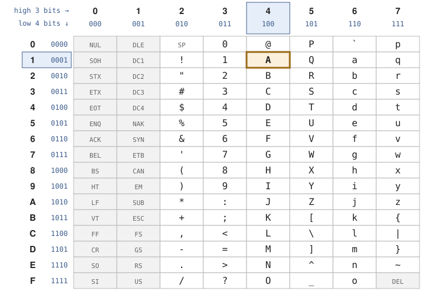
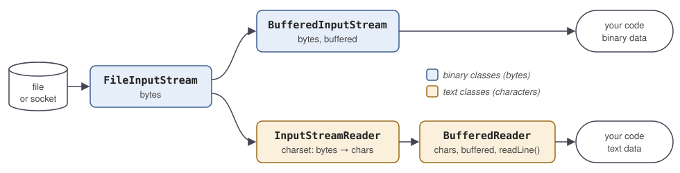

[Slides for this chapter](../slides/04-java-io.qmd)

## Objectives

By the end of this chapter, you should be able to:

- Explain the notions of source, stream and sink of data.
- Use the Java I/O API to read and write files, and later sockets.
- Tell binary data from text data, and pick the matching Java classes.
- Explain what a character encoding is (ASCII, Unicode, UTF-8, UTF-16),
  and always specify one when reading or writing text.
- Explain why buffering makes I/O fast.
- Handle line endings so your files work on every operating system.
- Close resources and handle errors with `try`-with-resources.

This chapter is the core of [practical work 1](../practical-work/pw1.qmd).

## Code examples

The examples and the exercise files of this chapter are in the
[code examples repository](), one directory per
chapter. Clone it once, and `git pull` when a new chapter starts:

```sh
git clone .git
cd dai-code-examples/04-java-io
```

Each example is a single Java file that you run directly, from its
directory (Java compiles it on the fly):

```sh
cd 01-reading-and-writing-binary-data
java BinaryWriteFileExample.java
```

Run each example when the text points to it, and read its comments.

## Why I/O in a network course?

Network programming is about reading and writing data: a server reads a
request from a client and writes a response back. In Java, **files and
network connections use the same API**: you read from an `InputStream`
and write to an `OutputStream`, whether the other end is a file on your
disk or a program on another continent.

It is the same abstraction: you write bytes to a stream. To a file,
they are written on disk. To a socket, they travel over the network to
another program.

Files are the easy case: no connection to open, no peer that can
disappear. So we learn the API on files first, and reuse it for network
programming later in the semester.

## Sources, streams and sinks

- A **source** produces data: a file, a network connection, the
  keyboard. It is also called a *producer*.
- A **sink** consumes data: a file, a network connection, the screen.
  It is also called a *consumer*.
- A **stream** is an ordered flow of data, read or written piece by
  piece: from a source into your program, or from your program to a
  sink.

## The `java.io` package

The classes of this chapter are in the
[`java.io`](https://docs.oracle.com/en/java/javase/25/docs/api/java.base/java/io/package-summary.html)
package of the `java.base` module. Two neighbours have confusingly
similar names:

- `java.nio` ("new I/O") is a more recent API, more flexible and
  sometimes more efficient, designed for advanced cases such as scalable
  servers. We do not cover it (see *Go further*). **Use `java.io` in the
  exercises and practical works**.
- `java.util.stream` (`IntStream`, `.map()`, `.filter()`…) is about
  functional-style processing of collections. It has nothing to do with
  I/O streams despite the name.

## Two types of data

All data is stored as bytes. What differs is how you *use* them:

- **Binary data** is used as raw bytes, without interpretation: images,
  audio, archives, compiled programs. You copy, compute or transform
  bytes.
- **Text data** must be *interpreted* to become characters: source
  code, CSV, JSON, configuration files. Turning bytes into characters
  requires a **character encoding** (see [Text data](#text-data)).

Java has one family of classes for each:

|          | Binary data (bytes)    | Text data (characters) |
|----------|------------------------|------------------------|
| Read     | `InputStream`          | `Reader`               |
| Write    | `OutputStream`         | `Writer`               |

These four abstract classes are the roots. Concrete subclasses say where
the data comes from or goes to (`FileInputStream`, `FileReader`…), or
add a feature on top of another stream (`BufferedInputStream`,
`InputStreamReader`…).

## Binary data

### Reading and writing bytes

Processing binary data is the simplest kind of processing, always in
three steps:

1. **Open** a stream on the file.
2. **Read or write** the bytes as they are, one at a time.
3. **Close** the stream.

| To…   | Abstract class | For a file         |
|-------|----------------|--------------------|
| Read  | `InputStream`  | `FileInputStream`  |
| Write | `OutputStream` | `FileOutputStream` |

Write the 256 possible byte values to a file:

```java
OutputStream out = new FileOutputStream("bytes.bin");
for (int i = 0; i < 256; i++) {
  out.write(i); // writes the lowest 8 bits of i
}
out.close();
```

Read them back, one byte at a time:

```java
InputStream in = new FileInputStream("bytes.bin");
int b; // a byte value 0-255, or -1 at the end of the stream
while ((b = in.read()) != -1) {
  System.out.print(b + " ");
}
in.close();
```

Example [`01-reading-and-writing-binary-data`](/tree/main/04-java-io/01-reading-and-writing-binary-data): `BinaryWriteFileExample` writes the bytes 0 to 255
to `binary-file.bin`, and `BinaryReadFileExample` reads them back one at
a time and prints them. Run the reader first to see what happens when
the file does not exist.

Three details to understand:

- `read()` is **blocking**: it waits until data is available. On a
  file, that is instant. On a network connection, `read()` waits until
  the other program sends something, possibly for a long time. Remember
  this, it will matter in the network chapters.
- `read()` returns an `int`, not a `byte`. Java has no unsigned byte
  type, and the method needs one extra value, `-1`, to say "end of the
  stream". So the values are `0` to `255`, or `-1`.
- **Close what you open.** An open file holds an operating system
  resource, and a program can only keep a limited number open. With the
  buffered streams below, closing is also what writes the last data to
  the file. We will see the proper way to close in
  [Errors and resources](#errors-and-resources).

### Buffering

Each `read()` or `write()` on a `FileInputStream` or `FileOutputStream`
is a **system call**: your program asks the operating system to read or
write *one* byte. A system call is expensive, so doing one per byte is
slow. On an Apple M3 laptop, writing 10 MiB byte by byte takes 12.8 s,
and reading it back 3.9 s ([exercise 2](#sec-ex2) lets you measure it
on your machine).

A **buffer** is a block of memory (8 KiB by default) between your
program and the operating system:

- When reading, the first `read()` fetches a whole block from the
  operating system into the buffer. The next calls are served from
  memory, without any system call, until the buffer is empty.
- When writing, `write()` fills the buffer in memory. Only when it is
  full is the whole block handed to the operating system in one system
  call.

Result: about one system call per 8 KiB instead of one per byte. On the
same laptop, the buffered versions take 59 ms (write) and 55 ms (read):
about 200 times faster for writing, 70 times for reading. Adding
a buffer is one line, because a buffered stream **wraps** another
stream:

```java
InputStream in = new BufferedInputStream(new FileInputStream("bytes.bin"));
OutputStream out = new BufferedOutputStream(new FileOutputStream("copy.bin"));
```

Your loop does not change: the buffered stream is still an
`InputStream` or an `OutputStream`. This pattern of wrapping an object
to add a feature is called a **decorator**. Closing the outer stream
also closes the inner one.

Example [`02-reading-and-writing-binary-data-with-buffers`](/tree/main/04-java-io/02-reading-and-writing-binary-data-with-buffers): the same
programs with `BufferedInputStream` and `BufferedOutputStream`. Compare
with example 01: only the line that opens the stream changes.

::: {.callout-important title="Flush"}
Data written to a buffered stream waits in memory until the buffer is
full. `flush()` sends what is in the buffer to the operating system
now. `close()` flushes before closing, so a file you close correctly
is complete. But on a network connection you keep open, you **must**
call `flush()` after each message, or the other side waits for data
that sits in your buffer. Take the habit now.
:::

### Reading and writing blocks

A buffer removes the system calls, but your program still calls
`read()` or `write()` once per byte. When you do not need to look at
each byte, move whole **blocks** at once with your own array:

```java
byte[] buffer = new byte[8192];
int n; // number of bytes read, or -1 at the end of the stream
while ((n = in.read(buffer)) != -1) {
  out.write(buffer, 0, n); // write only the n bytes that were read
}
```

- `read(byte[])` fills the array **as much as it can** and returns how
  many bytes it read. At the end of a file, and often on a network
  connection, that is fewer than the array size.
- So write `write(buffer, 0, n)`, never `write(buffer)`: the second one
  also writes the old bytes left at the end of the array. Copying a
  10,000-byte file with `write(buffer)` gives a 16,384-byte file.

Copying 10 MiB this way takes under 20 ms (4 to 18 ms in our runs),
against about 60 ms byte by byte through a buffered stream. With a
socket, you will read blocks in exactly the same way.

Example [`10-reading-and-writing-blocks`](/tree/main/04-java-io/10-reading-and-writing-blocks): copies its own source in
64-byte blocks and prints the size of each block. The last block is
smaller.

### Endianness

A number larger than one byte is stored as several bytes, in some order:

- **Big endian** (most significant byte first): `0x12345678` is stored
  as `0x12 0x34 0x56 0x78`.
- **Little endian** (least significant byte first): `0x12345678` is
  stored as `0x78 0x56 0x34 0x12`.

`InputStream` and `OutputStream` only deal with single bytes, so they
have no endianness. It matters as soon as you read or write numbers of
several bytes: a file format or a network protocol always specifies its
byte order. The Internet protocols (IP, TCP, UDP) use big endian, which
is why big endian is also called **network byte order**
([RFC 1700](https://www.rfc-editor.org/rfc/rfc1700),
[RFC 791](https://www.rfc-editor.org/rfc/rfc791), appendix B). Other
formats choose little endian: BMP images, WAV audio, or the numbers in
Protocol Buffers messages. Reading with the wrong order gives wrong
numbers, silently.

## Text data

### Bytes are not characters

A byte is 8 bits, nothing more. A character is an *interpretation* of
one or more bytes. The program that writes a text and the program that
reads it must agree on that interpretation. This agreement is the
**character encoding** (also called *charset*).

The encoding is usually **not stored in the file**. You have to know it,
or the file format has to state it (HTML and XML have a field for it,
JSON requires UTF-8).

### ASCII and code pages

**ASCII** (1963) maps 128 values to characters, so it uses 7 bits: `A`
is 65 (`0x41`), `a` is 97, the digit `0` is 48, and 0 to 31 are control
characters such as the line feed (10). It covers English and nothing
else: no `é`, no `ü`, no `ç`. The committee chose 7 bits to save
transmission costs. An 8th bit, when present, was used to detect
transmission errors (parity).

{fig-alt="The 128 ASCII characters in 8 columns (3 high bits) and 16 rows (4 low bits). A is highlighted at column 4, row 1."}

How to read the table:

- The column gives the 3 high bits, the row the 4 low bits.
- `A` is in column 4 (`100`) and row 1 (`0001`): `100 0001` = `0x41` =
  65.
- Columns 0 and 1 are control characters: `LF` (line feed) and `CR`
  (carriage return) come back in [Line endings](#line-endings).
- `A` to `Z` are `0x41` to `0x5A`, in order, and each lowercase letter
  is its uppercase letter plus 32 (`0x20`).

Once computers stored characters in 8-bit bytes, ASCII only used the
values 0 to 127, and the values 128 to 255 were free. Vendors used them
for the characters of their languages, each in their own way. These
extensions are called **code pages**: each one keeps ASCII for 0 to 127
and gives its own meaning to 128 to 255. Examples: ISO-8859-1
(Latin-1, Western Europe), ISO-8859-15 (Latin-9, adds `€`), Windows-1252
(a Latin-1 variant with extra characters such as `€` and curly quotes),
Mac OS Roman, and many more.

The same byte means different characters in different code pages, and
no code page can hold languages with thousands of characters such as
Chinese. Hence Unicode.

### Unicode

[Unicode](https://home.unicode.org/) is a catalogue of the characters of
(almost) all writing systems, plus symbols and emojis. Each character
gets a number, its **code point**, written `U+` in hexadecimal: `A` is
`U+0041` (same value as in ASCII), `é` is `U+00E9`, `€` is `U+20AC`,
`😂` is `U+1F602`. Unicode defines the character, not how it looks:
that is the job of the font.

Code points go from `U+0000` to `U+10FFFF`, about 1.1 million possible
values, of which more than 150,000 are assigned today. The first 65,536
(`U+0000` to `U+FFFF`) form the **Basic Multilingual Plane (BMP)**,
which covers most living languages. Emojis and rare scripts are above.
Unicode was first designed with 16 bits, but a code point does **not
always fit in 16 bits**: `U+10FFFF` needs 21.

::: {.callout-note}
Unicode is **not an encoding**: it says *which number* a character has,
not *which bytes* store that number. That is the job of the **UTF**
encodings (Unicode Transformation Formats).
:::

| Encoding | Bytes per character | Used by                                  |
|----------|---------------------|------------------------------------------|
| UTF-8    | 1 to 4              | The web, Linux, macOS, most files        |
| UTF-16   | 2 or 4              | Java, JavaScript and Windows, internally |
| UTF-32   | always 4            | Rarely used: simple, but large           |

The same code point gives different bytes in each encoding: `é`
(`U+00E9`) is `C3 A9` in UTF-8 and `00 E9` in UTF-16.

### UTF-8

UTF-8 stores each code point in 1 to 4 bytes. The `x` bits hold the
code point, and the first bits of each byte give its role:

| Code points          | Bytes | Bit pattern                                   |
|----------------------|------:|-----------------------------------------------|
| `U+0000`-`U+007F`    | 1     | `0xxxxxxx`                                    |
| `U+0080`-`U+07FF`    | 2     | `110xxxxx 10xxxxxx`                           |
| `U+0800`-`U+FFFF`    | 3     | `1110xxxx 10xxxxxx 10xxxxxx`                  |
| `U+10000`-`U+10FFFF` | 4     | `11110xxx 10xxxxxx 10xxxxxx 10xxxxxx`         |

- `0`: a character on 1 byte (ASCII).
- `110`, `1110`, `11110`: the first byte of a 2, 3 or 4-byte character.
- `10`: a continuation byte.

For example, `€` is `U+20AC` = `0010 0000 1010 1100`: 16 bits, so 3
bytes (`1110xxxx 10xxxxxx 10xxxxxx`). Filling the `x` bits from left to
right gives `11100010 10000010 10101100` = `E2 82 AC`.

Consequences:

- ASCII characters take 1 byte, with the same value as in ASCII: **an
  ASCII file is also a valid UTF-8 file**.
- Accented Latin letters, Greek, Cyrillic, Arabic take 2 bytes. Most
  Chinese, Japanese and Korean characters take 3, emojis take 4.

UTF-8 is the encoding of the web, of Linux and macOS, and of most modern
formats and languages. **When you choose, choose UTF-8.**

### UTF-16

UTF-16 stores each code point in 2 bytes, or 4 above the BMP. Java uses
it inside its strings (see below). It is **not compatible with ASCII**: `A`
is one byte in ASCII (`0x41`), but two bytes in UTF-16 (`0x00 0x41`).
And two bytes per character means a byte order (see
[Endianness](#endianness)): `A` is `0x00 0x41` in UTF-16BE (big endian)
and `0x41 0x00` in UTF-16LE. You will rarely write files in UTF-16.

### The UTF-8 byte order mark

Some Windows tools (Notepad, Excel when saving "CSV UTF-8") start a
UTF-8 file with the bytes `EF BB BF`, called a **byte order mark
(BOM)**. It is the code point `U+FEFF`, a leftover of UTF-16 where it
tells the byte order. In UTF-8 it is useless, and **Java does not remove
it**: the first line you read starts with an invisible character.

```java
String header = reader.readLine(); // "\uFEFFname,age", displayed as "name,age"
header.startsWith("name");         // false!
```

If your program reads files that come from Windows, skip the `U+FEFF` at
the start ([exercise 6](#sec-ex6)). Example [`09-byte-order-mark`](/tree/main/04-java-io/09-byte-order-mark)
writes a CSV file that starts with a BOM, shows that the header no
longer starts with `name`, then removes the BOM.

### Java and Unicode

A Java `String` holds Unicode text, so it can contain any language. But:

- A `char` is 16 bits: one UTF-16 *unit*, not one character. A code
  point above the BMP (an emoji) needs **two** `char`s (see *Go
  further*: surrogate pairs). `"I😂DAI".length()`
  returns 6, not 5. Use `codePoints()` when you need real characters
  ([exercise 4](#sec-ex4)). Example [`08-code-points`](/tree/main/04-java-io/08-code-points) walks
  through `"I😂DAI"` twice: with `charAt()` (6 `char`s, the emoji
  appears as two numbers) and with `codePoints()` (5 code points).
- Encoding happens at the border, when characters become bytes (writing)
  or bytes become characters (reading). That is where you give the
  charset.

Since Java 18, the default charset of the file APIs is UTF-8 on every
platform (before, it depended on the operating system). **Specify it
anyway**: the code says what it does, it behaves the same on older
Java versions, and the files you read are not always UTF-8.

### What if you get the encoding wrong?

Decode bytes with the wrong charset and you get garbage, known as
**mojibake**:

- `élève` written in UTF-8 and read as ISO-8859-1 or Windows-1252
  shows `élève`: each 2-byte UTF-8 character appears as two Latin-1
  characters.
- Write `élève` in US-ASCII and you get `?l?ve`: characters that do not
  exist in the target charset are replaced by `?`, and lost for good.

Example [`03-character-encodings`](/tree/main/04-java-io/03-character-encodings): encodes "student" in English,
French, Japanese, Ukrainian and Arabic with five charsets, then decodes
the bytes as UTF-8. Look at the number of bytes, and at where `?` or
garbage appears.

### Reading and writing text

`FileReader` and `FileWriter` read and write characters, and accept a
charset:

```java
Reader reader = new FileReader("in.txt", StandardCharsets.UTF_8);
Writer writer = new FileWriter("out.txt", StandardCharsets.UTF_8);

int c; // a char value 0-65535, or -1 at the end of the stream
while ((c = reader.read()) != -1) {
  writer.write(c);
}
```

The general form builds the chain explicitly, and adds a buffer:

```java
BufferedReader reader = new BufferedReader(
    new InputStreamReader(new FileInputStream("in.txt"), StandardCharsets.UTF_8));
BufferedWriter writer = new BufferedWriter(
    new OutputStreamWriter(new FileOutputStream("out.txt"), StandardCharsets.UTF_8));
```

Read it from the inside out, as a chain of layers:

{fig-alt="FileInputStream reads bytes from a file or socket. For binary data, a BufferedInputStream wraps it. For text, an InputStreamReader decodes the bytes into characters with a charset, and a BufferedReader wraps that."}


1. `FileInputStream`: bytes from the file.
2. `InputStreamReader`: decodes the bytes into characters with the
   given charset.
3. `BufferedReader`: adds a buffer.

Examples: [`04-reading-and-writing-text-data`](/tree/main/04-java-io/04-reading-and-writing-text-data) copies its own
source file character by character with `FileReader` and `FileWriter`
(UTF-8), and [`05-reading-and-writing-text-data-with-buffers`](/tree/main/04-java-io/05-reading-and-writing-text-data-with-buffers)
does the same copy with `BufferedReader` and `BufferedWriter`.

**Text is always built on top of bytes**: both branches of the diagram
start from the same byte stream, and the text classes wrap the binary
ones. `FileInputStream` plus `InputStreamReader` is so common that one
class combines them: `FileReader`. Writing mirrors reading:
`FileOutputStream`, then `OutputStreamWriter`, then `BufferedWriter`.

**Remember this chain**: with a network connection, you get an
`InputStream` from the socket instead of a file, and wrap it exactly the
same way.

### Line endings

The end of a line is marked by one or two control characters, depending
on the operating system:

| Operating system        | Line ending | Characters            |
|-------------------------|-------------|-----------------------|
| Linux, macOS            | LF          | `\n` (`0x0A`)         |
| Windows                 | CR LF       | `\r\n` (`0x0D 0x0A`)  |

`BufferedReader.readLine()` reads one line and returns it **without**
its line ending (and `null` at the end of the file). It accepts both
`\n` and `\r\n`.

When you write, you add the line ending yourself:

```java
static final String EOL = "\n";

String line;
while ((line = reader.readLine()) != null) {
  writer.write(line + EOL);
}
```

Use a constant (or a command-line option) rather than
`System.lineSeparator()` or `BufferedWriter.newLine()`: those depend on
the machine that runs the program, so the same program would produce
different files on Windows and on Linux. Network protocols (HTTP, SMTP)
require `\r\n` whatever your operating system, so the habit of choosing
explicitly will pay off.

Example [`06-end-of-line-characters`](/tree/main/04-java-io/06-end-of-line-characters): copies its own source line by
line with the full `InputStreamReader` chain, and writes `\n` after
each line.

## Errors and resources

Many things can go wrong with I/O: the file does not exist, you lack the
permission, the disk is full, the network connection drops. Java reports
them with exceptions:

- `FileNotFoundException`: the file cannot be opened (missing, or no
  permission).
- `IOException`: the parent of all I/O errors. Almost every I/O method
  can throw it. It is a **checked** exception: the compiler forces you
  to handle it (catch it, or declare it with `throws`).
- `UnsupportedCharsetException`: the charset name is unknown
  (`Charset.forName("BOGUS")`). It is an **unchecked** exception: the
  compiler does not force you to handle it, so remember to do it when
  the name comes from a user.

Whatever happens, **opened resources must be closed**. This version does
not: if an exception occurs before the `close()` calls, they are skipped
and the files stay open.

```java
try {
  Reader reader = new FileReader("in.txt", StandardCharsets.UTF_8);
  Writer writer = new FileWriter("out.txt", StandardCharsets.UTF_8);
  writer.write(reader.read());
  writer.close(); // skipped if an exception occurs above
  reader.close();
} catch (IOException e) {
  System.err.println("Error: " + e.getMessage());
}
```

The classic fix closes the resources in a **`finally`** block, which
runs whether an exception occurred or not:

```java
Reader reader = null;
Writer writer = null;
try {
  reader = new FileReader("in.txt", StandardCharsets.UTF_8);
  writer = new FileWriter("out.txt", StandardCharsets.UTF_8);
  writer.write(reader.read());
} catch (IOException e) {
  System.err.println("Error: " + e.getMessage());
} finally {
  if (writer != null) {
    try {
      writer.close();
    } catch (IOException e) {
      System.err.println("Error closing writer: " + e.getMessage());
    }
  }
  if (reader != null) {
    try {
      reader.close();
    } catch (IOException e) {
      System.err.println("Error closing reader: " + e.getMessage());
    }
  }
}
```

Read it carefully, it is subtle:

- The variables are declared **before** the `try`, so that `finally`
  can see them, and set to `null`, because the `try` may fail before
  they are assigned.
- `finally` checks for `null`: if `FileReader` failed, there is no
  reader to close.
- Each `close()` can itself throw an `IOException`, so each needs its
  own `try`-`catch`. Otherwise a failing `writer.close()` would skip
  `reader.close()`.

This is correct, but long, and every line is an opportunity for a bug.
You will meet this pattern in older code, so understand it.

The modern way is **`try`-with-resources**: declare the resources in
parentheses after `try`, and Java closes them at the end of the block, in
reverse order, even when an exception occurs:

```java
try (Reader reader = new FileReader("in.txt", StandardCharsets.UTF_8);
    Writer writer = new FileWriter("out.txt", StandardCharsets.UTF_8)) {
  int c;
  while ((c = reader.read()) != -1) {
    writer.write(c);
  }
} catch (IOException e) {
  System.err.println("Error: " + e.getMessage());
}
```

It works with every class that implements
[`AutoCloseable`](https://docs.oracle.com/en/java/javase/25/docs/api/java.base/java/lang/AutoCloseable.html),
which includes all the streams, readers and writers of this chapter (and
the sockets of later chapters). **Use it for every resource you open.**

Example [`07-dealing-with-errors`](/tree/main/04-java-io/07-dealing-with-errors): runs the three versions (no
`finally`, `finally`, `try`-with-resources) on a file that does not
exist.

## Which class for which job?

A quick reference. Remember that the columns combine: text classes wrap
binary ones (see [the diagram](#reading-and-writing-text)).

| You need to…                              | Binary data                                   | Text data                                                     |
|-------------------------------------------|-----------------------------------------------|---------------------------------------------------------------|
| Read / write a file                       | `FileInputStream` / `FileOutputStream`        | `FileReader` / `FileWriter`, with a charset                   |
| Turn bytes into characters and back       |                                               | `InputStreamReader` / `OutputStreamWriter`, with a charset    |
| Work in memory                            | `ByteArrayInputStream` / `ByteArrayOutputStream` | `StringReader` / `StringWriter`                            |
| Go fast (always)                          | `BufferedInputStream` / `BufferedOutputStream` | `BufferedReader` / `BufferedWriter`                          |
| Read line by line                         |                                               | `BufferedReader.readLine()`                                   |

::: {.callout-warning title="Common pitfalls"}
- **No charset** on a reader or writer: correct by luck on your machine,
  wrong elsewhere.
- **No buffer**: correct, but slow.
- **No close, or no flush**: incomplete files, and later, messages that
  never leave your program.
- **`PrintWriter`**: convenient, but it **swallows errors** (its methods
  never throw, you have to call `checkError()`). Do not use it in this
  course. Use `BufferedWriter`.
- **`BufferedReader.ready()`** to detect the end of a file: it only says
  whether a read would block right now. Loop until `readLine()` returns
  `null`.
- **`String.length()`** to count characters: it counts UTF-16 units.
- **`write(buffer)` after `read(buffer)`**: writes the whole array, not
  only the bytes read. Use `write(buffer, 0, n)`.
:::

## Exercises

::: {.callout-important title="First, the code examples"}
Before the exercises, go through the
[code examples](#code-examples) `01` to `10`, in order: run each one
from its directory and read its code and comments. The exercises build
on them.
:::

Then work in the `04-java-io` directory of the
[code examples repository](#code-examples). The starting files of the
exercises are in `exercises/`. On Windows, use your WSL terminal.

### Exercise 1: Bytes in, bytes out {#sec-ex1}

In `01-reading-and-writing-binary-data`:

1. Run `java BinaryReadFileExample.java` first. What happens, and why?
2. Run `java BinaryWriteFileExample.java`, then the reader again.
3. Look at the file with a hex dump tool: `od -A d -t x1 binary-file.bin`.
   Where are the letters of the alphabet?
4. In the writer, predict what `fos.write(300)` writes, then check it.

**Verification**: the reader prints `0 1 2 … 255`, and the file is
exactly 256 bytes (`ls -l binary-file.bin`).

::: {.callout-tip collapse="true" title="Solution"}
- **Step 1**: a `FileNotFoundException`. The file does not exist yet,
  and the `throws IOException` of `main` lets the exception stop the
  program.
- **Step 3**: `A` to `Z` are bytes `0x41` to `0x5a` (65 to 90), `a` to
  `z` are `0x61` to `0x7a`: the ASCII codes.
- **Step 4**: `write(int)` keeps only the lowest 8 bits: 300 = `0x12C`,
  so it writes `0x2C` (44, the ASCII code of `,`).
:::

### Exercise 2: Measure buffering {#sec-ex2}

`exercises/Benchmark.java` writes and reads 10 MiB byte by byte, first
without, then with a buffer. Read it, then run it (the unbuffered part
takes a few seconds):

```sh
java exercises/Benchmark.java
```

1. Note the four times. How many times faster is the buffered version?
2. How many system calls does each version make, roughly?
3. Change `SIZE` to 1 KiB (`1024`). Is buffering still worth it?
4. Add a fifth measurement: copy `data.bin` to `copy.bin` in 8 KiB
   blocks with `read(byte[])` and `write(byte[], int, int)`, without
   buffered streams. How long does it take?

**Verification**: the buffered times are tens to hundreds of times
smaller. On an Apple M3 laptop: 12,770 ms (write) and 3,942 ms (read)
unbuffered, 59 ms and 55 ms buffered.

::: {.callout-tip collapse="true" title="Solution"}
2. Unbuffered: one per byte, about 10 million in each direction.
   Buffered: one per 8 KiB block, about 1,300.
3. With 1 KiB, both versions finish in a few milliseconds, too little
   to measure reliably. Buffering matters when there is a lot of data,
   but it never hurts: always buffer.
4. Under 20 ms on the M3 laptop (4 to 18 ms), several times faster than byte by byte
   through a buffer: there are no per-byte method calls left.

```java
start = System.nanoTime();
try (InputStream in = new FileInputStream("data.bin");
    OutputStream out = new FileOutputStream("copy.bin")) {
  byte[] buffer = new byte[8192];
  int n;
  while ((n = in.read(buffer)) != -1) {
    out.write(buffer, 0, n);
  }
}
System.out.println("Block copy:       " + ms(start) + " ms");
```
:::

### Exercise 3: Encode by hand {#sec-ex3}

1. Using the [UTF-8 table](#utf-8), encode `é` (`U+00E9`) by hand:
   write the code point in binary, choose the number of bytes, fill the
   `x` bits. Which bytes do you get?
2. Check your answer with `java exercises/Encodings.java`. Explain each
   line of the first part of its output.
3. The second part encodes "student" in English, French, Japanese,
   Ukrainian and Arabic. For each language, how many bytes does one
   character take in UTF-8? In UTF-16? Which encoding is more compact
   for Japanese?

::: {.callout-tip collapse="true" title="Solution"}
1. `0xE9` = `000 1110 1001` needs 11 bits: 2 bytes, `110xxxxx
   10xxxxxx`. The 11 bits split as `00011` and `101001`, giving
   `11000011 10101001` = `C3 A9`.
2. Output and explanation:

```text
US-ASCII    5 bytes: 3F 6C 3F 76 65
ISO-8859-1  5 bytes: E9 6C E8 76 65
UTF-8       7 bytes: C3 A9 6C C3 A8 76 65
UTF-16     12 bytes: FE FF 00 E9 00 6C 00 E8 00 76 00 65
UTF-8 read as ISO-8859-1: élève
```

- US-ASCII has no `é` or `è`: they become `?` (`3F`), lost.
- ISO-8859-1: one byte per character, `é` is `E9`, as in Unicode.
- UTF-8: `é` and `è` take 2 bytes, the ASCII letters 1.
- UTF-16: a BOM `FE FF` (big endian), then 2 bytes per character.
- Decoding `C3 A9` as ISO-8859-1 gives two characters, `Ã` and `©`:
  mojibake.

3. Second part:

```text
student  7 characters,  7 bytes in UTF-8, 14 bytes in UTF-16BE
élève    5 characters,  7 bytes in UTF-8, 10 bytes in UTF-16BE
学生      2 characters,  6 bytes in UTF-8,  4 bytes in UTF-16BE
студент  7 characters, 14 bytes in UTF-8, 14 bytes in UTF-16BE
طالب     4 characters,  8 bytes in UTF-8,  8 bytes in UTF-16BE
```

In UTF-8: 1 byte per ASCII letter, 2 for accented Latin, Cyrillic and
Arabic letters, 3 for Japanese. UTF-16 takes 2 bytes for all of them,
so it is more compact than UTF-8 for Japanese, and twice as large for
English.
:::

### Exercise 4: Count the characters {#sec-ex4}

In `08-code-points`, read `CodePointsExample.java` but do not run it
yet.

1. What do you expect for `length()`? For the number of code points?
2. Run it. Explain the difference, and the two strange numbers of the
   first loop.
3. How many bytes does `"I😂DAI"` take in UTF-8?

::: {.callout-tip collapse="true" title="Solution"}
2. `length()` is 6, code points are 5. `😂` (`U+1F602`) is above the
   BMP: Java stores it as two `char`s (a *surrogate pair*, 55357 and
   56834), and `length()` counts `char`s. Each half alone is not a
   character, so it prints as `?`.
3. 8 bytes: 1 for each of the four ASCII letters, 4 for the emoji
   (check with `text.getBytes(StandardCharsets.UTF_8).length`).
:::

### Exercise 5: Convert an encoding {#sec-ex5}

A colleague sends you a file in ISO-8859-1 (Latin-1). Convert it to
UTF-8 with `exercises/Transcode.java`. This is a small version of what
[PW1](../practical-work/pw1.qmd) asks.

1. Create the test file (the `\x..` are Latin-1 bytes, `\r\n` Windows
   line endings):

```sh
printf 'caf\xe9 cr\xe8me br\xfbl\xe9e\r\nna\xefve\r\n' > latin1.txt
cat latin1.txt   # your UTF-8 terminal shows garbage: why?
```

2. Read `Transcode.java`: find the three layers of the chain. Then run
   it:

```sh
java exercises/Transcode.java latin1.txt ISO-8859-1 utf8.txt UTF-8
cat utf8.txt
ls -l latin1.txt utf8.txt   # why are the sizes different?
```

3. Now convert `utf8.txt` to `US-ASCII` and look at the result.
4. Run it with a file that does not exist, then with the charset
   `BOGUS`. One of the two errors gives a clean message, the other a
   stack trace. Fix the second one.

**Verification**: `cat utf8.txt` shows `café crème brûlée` and
`naïve`. With `BOGUS`, the program prints one clear line and exits
with code 1 (`echo $?`).

::: {.callout-tip collapse="true" title="Solution"}
1. The terminal decodes the bytes as UTF-8. `E9` alone is not valid
   UTF-8, so it shows a replacement symbol.
2. The three layers: `FileInputStream` (bytes), `InputStreamReader`
   (decodes with `inCharset`), `BufferedReader` (buffer), and the
   mirror on the writing side. `utf8.txt` is 5 bytes larger: the five
   accented letters take 2 bytes in UTF-8 instead of 1.
3. `caf? cr?me br?l?e`: US-ASCII has no accented letters.
4. `Charset.forName` throws an `UnsupportedCharsetException`, which is
   unchecked and outside the `try`. Catch it where the charsets are
   parsed:

```java
Charset inCharset;
Charset outCharset;
try {
  inCharset = Charset.forName(args[1]);
  outCharset = Charset.forName(args[3]);
} catch (IllegalArgumentException e) { // parent of UnsupportedCharsetException
  System.err.println("Unknown charset: " + e.getMessage());
  System.exit(1);
  return; // never reached, but the compiler does not know that exit() never returns
}
```
:::

### Exercise 6: The invisible character {#sec-ex6}

1. In `09-byte-order-mark`, run `java ByteOrderMarkExample.java`.
   Then look at the file it created: `od -c with-bom.csv | head -1`.
2. Convert that file with your `Transcode` from exercise 5, from UTF-8
   to UTF-8:
   `java ../exercises/Transcode.java with-bom.csv UTF-8 out.csv UTF-8`.
   Is the BOM still there in the output (`od -c out.csv | head -1`)?
3. Change `Transcode` so that it drops a BOM at the start of the input,
   and only there.

**Verification**: `od -c` of the output starts with `n a m e`, and a
file without a BOM is copied unchanged (`cmp` prints nothing).

::: {.callout-tip collapse="true" title="Solution"}
1. `od -c` starts with `357 273 277`: the bytes `EF BB BF` in octal,
   before `n a m e`.
2. Yes: Java decoded the BOM as the character `U+FEFF`, and the writer
   encoded it again.
3. `BufferedReader` can mark a position and come back to it. Before the
   copy loop:

```java
reader.mark(1);
if (reader.read() != '\uFEFF') { // skip a BOM, keep anything else
  reader.reset();
}
```
:::

### Exercise 7: Line endings {#sec-ex7}

`utf8.txt` from exercise 5 still has Windows line endings.
`exercises/ToUnix.java` converts them to Unix (LF).

1. Run `java exercises/ToUnix.java utf8.txt unix.txt`.
2. Compare `od -c utf8.txt` and `od -c unix.txt`. What disappeared?
3. Add a third argument, `lf` or `crlf`, to choose the line ending of
   the output.

**Verification**: `od -c unix.txt` shows `\n` and no `\r`. With `crlf`,
the output is identical to the input (`cmp utf8.txt out.txt` prints
nothing).

::: {.callout-tip collapse="true" title="Solution"}
2. The `\r` before each `\n` disappeared: `readLine()` removed the
   `\r\n`, and the program wrote `\n` only.
3. Choose the ending from the third argument, then use it in the loop:

```java
String eol = args.length > 2 && args[2].equals("crlf") ? "\r\n" : "\n";
// ...
writer.write(line + eol);
```
:::

### Exercise 8: Close it properly {#sec-ex8}

This method has four problems. Find them, then rewrite it with
`try`-with-resources:

```java
public static void copy(String from, String to) throws IOException {
  FileReader reader = new FileReader(from);
  FileWriter writer = new FileWriter(to);
  int c;
  while ((c = reader.read()) != -1) {
    writer.write(c);
  }
  reader.close();
  writer.close();
}
```

Then call your version with a source file that does not exist. Is the
destination file created? Why?

::: {.callout-tip collapse="true" title="Solution"}
Problems:

1. No charset on the reader and the writer.
2. No buffering.
3. If `read()` or `write()` throws, nothing is closed.
4. If `reader.close()` throws, `writer` is never closed (and its data
   never flushed).

```java
public static void copy(String from, String to) throws IOException {
  try (BufferedReader reader =
          new BufferedReader(new FileReader(from, StandardCharsets.UTF_8));
      BufferedWriter writer =
          new BufferedWriter(new FileWriter(to, StandardCharsets.UTF_8))) {
    int c;
    while ((c = reader.read()) != -1) {
      writer.write(c);
    }
  }
}
```

The destination is **not** created: resources are opened in order, the
reader fails first, so the writer is never opened.
:::

## Test your knowledge

- What are a source, a stream and a sink? Give two examples of each.
- What is the difference between binary data and text data? Which Java
  classes handle each?
- Why is a buffered stream faster? When must you call `flush()`?
- What is the difference between Unicode and UTF-8?
- How many bytes does `é` take in ISO-8859-1, UTF-8 and UTF-16? Why?
- What do you see when UTF-8 text is read as ISO-8859-1? When text is
  written in US-ASCII?
- Why can `String.length()` differ from the number of characters?
- Why does the first line of some CSV files not start with the
  expected text, and how do you fix it?
- Which line endings do Linux and Windows use? Why should you not rely
  on `System.lineSeparator()`?
- What does `try`-with-resources guarantee?

## Go further

Optional content: useful general knowledge, not required for the
evaluations.

::: {.callout-note collapse="true" title="Surrogate pairs: how UTF-16 stores emojis"}
A 16-bit unit holds only the code points of the BMP (up to `U+FFFF`). A
code point above it is stored as a **surrogate pair**: two 16-bit units
taken from a range that Unicode reserves for this purpose (`U+D800` to
`U+DFFF`, where no character is ever assigned). The first unit is
between `D800` and `DBFF`, the second between `DC00` and `DFFF`, so a
program that meets one knows it must read the other.

`😂` (`U+1F602`) becomes the pair `0xD83D 0xDE02`, which is why Java
stores it in two `char`s (55357 and 56834 in example `08-code-points`).
Neither half is a character on its own.
:::

::: {.callout-note collapse="true" title="Reading numbers and byte orders"}
`DataInputStream` and `DataOutputStream` read and write Java primitive
types (`readInt()`, `writeDouble()`…) in big endian. For little-endian
formats (BMP, WAV), read the bytes into a `ByteBuffer` and call
`order(ByteOrder.LITTLE_ENDIAN)` before `getInt()`.
:::

::: {.callout-note collapse="true" title="java.nio.file: the shortcut API"}
The `Files` class offers one-liners: `Files.readString(path)`,
`Files.readAllLines(path, charset)`, `Files.newBufferedReader(path,
charset)`, `Files.copy(...)`. They are convenient in real projects, but
the one-liners load the whole file into memory, and they hide the
stream mechanics that you need to understand for network programming.
Not in this course's exercises and practical works.
:::

::: {.callout-note collapse="true" title="One character, two encodings: normalization"}
`é` can be one code point (`U+00E9`) or two: `e` followed by a combining
accent (`U+0065 U+0301`). They look the same, but
`"é".equals("é")` is `false`. macOS file names use the second
form. `java.text.Normalizer` converts between the forms (NFC and NFD).
:::

::: {.callout-note collapse="true" title="Reading"}
- Joel Spolsky, [The Absolute Minimum Every Software Developer Must
  Know About Unicode and Character
  Sets](https://www.joelonsoftware.com/2003/10/08/the-absolute-minimum-every-software-developer-absolutely-positively-must-know-about-unicode-and-character-sets-no-excuses/)
  (2003, still true).
- [UTF-8 Everywhere](https://utf8everywhere.org/): why UTF-8 should be
  the default.
- [JEP 400: UTF-8 by Default](https://openjdk.org/jeps/400).
- Modulo, [Les caractères](https://apprendre.modulo-info.ch/rep-info/caracteres.html)
  (in French).
:::

## Sources

- O. Tischhauser, with the help of
  [Claude](https://claude.com) (Anthropic).
- Based on the
  [HEIG-VD DAI course](https://github.com/heig-vd-dai-course/heig-vd-dai-course)
  by L. Delafontaine and H. Louis, licensed
  [CC BY-SA 4.0](https://creativecommons.org/licenses/by-sa/4.0/), itself
  based on the original course by O. Liechti and J. Ehrensberger.
- Buffering benchmark and code point example adapted from the DAI course
  of J. Ehrensberger.
