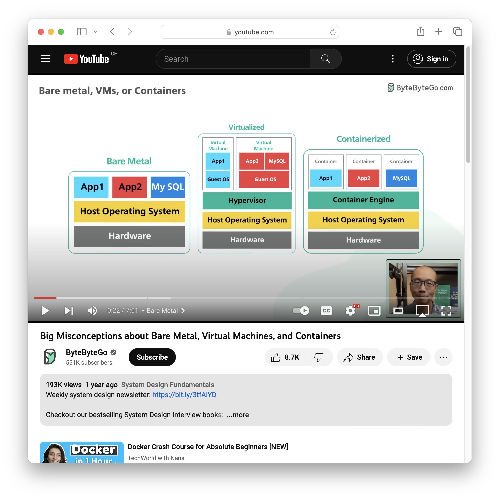

## Objectives

By the end of this chapter, you should be able to:

- Explain the differences between bare metal, virtualization and
  containerization.
- Explain how the OCI specification defines images, containers and registries.
- Use Docker and Docker Compose to **build, publish and run** applications in
  containers, so they run anywhere Docker is installed.

## Setup

### Install Docker and Docker Compose

::: {.panel-tabset}

#### Linux / Windows (WSL)

Install [Docker Engine](https://docs.docker.com/engine/install/) for your
distribution **from the repository** (not Docker Desktop):
[Debian](https://docs.docker.com/engine/install/debian/) ·
[Fedora](https://docs.docker.com/engine/install/fedora/) ·
[Ubuntu](https://docs.docker.com/engine/install/ubuntu/) ·
[others](https://docs.docker.com/engine/install/).

Then follow the
[post-installation steps](https://docs.docker.com/engine/install/linux-postinstall/):
*"Manage Docker as a non-root user"* and *"Configure Docker to start on boot"*.

#### macOS

Install [Docker Desktop](https://docs.docker.com/desktop/). It runs Docker
Engine and Docker Compose inside a virtual machine.

:::

Check the installation:

```sh
docker --version
docker compose version
```

If either command fails, make sure the Docker daemon is running.

### Get the code examples

Clone (or pull) the course examples repository, then open
`examples/05-docker/` in your IDE. Each numbered example has a README
explaining how to run it — we will refer to them throughout the chapter.

## Bare metal, virtualization and containerization

These are three different ways to run software on a computer (remember: a
server is just a computer — the "Cloud" is just someone else's computer).



**Bare metal** — the traditional way: software is installed directly on the
machine and has access to all its resources. Fastest, but no isolation.

**Virtualization** — software runs inside a virtual machine: a complete
virtual computer, isolated from the host. Good isolation, but heavy: each VM
boots a full operating system, which costs startup time, disk and memory.

**Containerization** — software runs in a container: an isolated environment
that **shares the host's operating system kernel** and starts only the
application itself. Containers give you most of the isolation of a VM at a
fraction of the cost — they start in seconds and are much lighter.

## OCI: images, containers and registries

The [OCI specification](https://opencontainers.org/) defines a standard for
containers, implemented by Docker and other container engines. Three terms
matter:

- **Image** — a read-only template with instructions for creating a
  container. An image is an executable package containing the application and
  all its dependencies. Images are **immutable** and built from **layers**.
- **Container** — a running instance of an image, isolated from the host and
  from other containers.
- **Registry** — a service that stores images, from which they can be pushed
  and pulled.

The default registry is [Docker Hub](https://hub.docker.com). In this course
we use the
[GitHub Container Registry](https://docs.github.com/en/packages/working-with-a-github-packages-registry/working-with-the-container-registry)
(`ghcr.io`) so your images live next to your code.

## Docker

Docker is a container engine composed of two parts:

- the **Docker daemon** — a background service that manages images and
  containers;
- the **Docker CLI** — the `docker` command, which talks to the daemon.

On Linux the daemon runs natively; on macOS and Windows it runs inside a
virtual machine.

Run your first container:

```sh
docker run hello-world:latest
```

Docker pulls the `hello-world` image from Docker Hub (it is not on your
machine yet), creates a container from it and runs it. The `:latest` tag is
the default and can be omitted. Read the output — it narrates exactly these
steps.

You can run a full Linux distribution the same way:

```sh
docker run --rm -it ubuntu /bin/bash
```

- `--rm` removes the container when it exits.
- `-it` attaches your terminal interactively.
- `/bin/bash` overrides the image's default command.

Inside, you can install software and modify files like on any system — and
every change is lost when the container stops. Type `exit` to leave.

### Dockerfile

A **Dockerfile** is a text file with the instructions to build an image, one
layer per instruction. The most important instructions:

| Instruction | Role |
|-------------|------|
| `FROM` | base image to start from |
| `RUN` | run a command while **building** the image |
| `COPY` | copy files from the build context into the image |
| `ENTRYPOINT` | the executable to run when the container starts |
| `CMD` | default arguments (or default command) at container start |
| `WORKDIR` | working directory for subsequent instructions |
| `ENV`, `EXPOSE`, `VOLUME`, `ARG` | environment, ports, volumes, build args |

Build and run:

```sh
docker build -t <image-name> <build-context>
docker run <image-name>
```

::: {.callout-important}
Work through code examples **01 to 05** (basic Dockerfile → entrypoint vs.
command → run/copy → ports). The `ENTRYPOINT` vs. `CMD` distinction is a
classic exam and interview question.
:::

::: {.callout-tip collapse="true" title="Docker cheatsheet"}
```sh
docker build -t <image-name> <build-context>   # build and tag an image
docker run <image-name>                        # start a container
docker run -d <image-name>                     # ... in the background
docker ps                                      # list running containers
docker stop <container-id>                     # stop a container
docker exec -it <container-id> /bin/sh         # shell into a running container
docker run --entrypoint /bin/sh <image-name>   # override the entrypoint
docker run <image-name> <command>              # override the command
docker container prune                         # delete stopped containers
docker image prune                             # delete unused images
```
:::

## Docker Compose

Docker Compose runs **multi-container applications** (a *stack* — e.g. a
backend and its database) declared in a single YAML file, `compose.yaml`.
The file is versioned with your application, which makes the whole stack
reproducible with one command.

A Compose file declares:

- **services** — the containers of the stack;
- **volumes** — directories shared between host and containers, to persist
  data;
- **networks** — how services communicate.

```sh
docker compose up      # create and start the whole stack
docker compose down    # stop and remove everything it created
```

::: {.callout-important}
Work through code examples **06 to 09** (basic Compose → ports → volumes →
environment variables).
:::

::: {.callout-tip collapse="true" title="Docker Compose cheatsheet"}
```sh
docker compose up              # start all services (creates resources)
docker compose up -d           # ... in the background
docker compose ps              # list running services
docker compose down            # stop and remove created resources
docker compose stop            # stop without removing
docker compose start           # restart previously stopped services
docker compose logs [-f] [<service>]   # inspect (follow) logs
```
:::

::: {.callout-note collapse="true" title="`docker compose` vs. `docker-compose`"}
Old tutorials use `docker-compose` (v1, Python, deprecated). The current
version is v2, invoked as `docker compose`. If you find an old example,
just replace the hyphen with a space.
:::

## Docker networks

Containers are isolated by default: they cannot talk to each other unless
they share a **network**.

```sh
docker network create <network-name>
docker network list
docker network rm <network-name>
```

Services declared in the same Compose file are connected to a default
network automatically, and **each container can be reached by its service
name** (Docker provides DNS resolution on the network). Custom networks let
containers from different stacks communicate.

::: {.callout-important}
Work through code examples **10 and 11** (container-to-container
communication with Docker, then with Docker Compose).
:::

## Exercises

### Warm-up drills {#sec-drills}

Quick checks that the basics stick — each should take a few minutes.

1. Run an nginx web server on port 8080 of your machine, verify it
   answers with `curl localhost:8080`, then stop and remove the
   container.
2. From memory, write a Dockerfile for an Alpine image whose container
   prints the current date on start — build it and run it. Then override
   the command at run time to print `hello` instead. (Which instruction
   did you use — `ENTRYPOINT` or `CMD` — and why?)
3. Write a minimal `compose.yaml` running the same image, and run it
   with `docker compose up`.

::: {.callout-tip collapse="true" title="Solutions — warm-up drills"}
```sh
# 1.
docker run -d -p 8080:80 --name web nginx
curl localhost:8080
docker stop web && docker rm web
```

```dockerfile
# 2. Dockerfile — CMD so the command stays overridable at run time
FROM alpine
CMD ["date"]
```

```sh
docker build -t drill .
docker run --rm drill          # prints the date
docker run --rm drill echo hello   # overrides CMD
```

```yaml
# 3. compose.yaml
services:
  drill:
    build: .
```
:::

### Main exercise — containerize your application

You will containerize the CLI application from the
[Java IOs chapter](04-java-io.qmd). If you do not have your own, clone and
compile that chapter's solution to get the JAR file.

### Exercise 1 — Package your application {#sec-ex1}

Create a file named `Dockerfile` (no extension) at the root of your Java IOs
project, starting from:

```dockerfile
# Base image: Java 25 runtime (JRE), provides the `java` command
FROM eclipse-temurin:25-jre
```

Complete it so the image contains your JAR and runs it on start. Then build
and validate:

```sh
docker build -t java-ios-docker .

# Write, then read, a file through a mounted volume
docker run --rm -v "$(pwd):/data" java-ios-docker \
  --implementation BUFFERED_BINARY /data/100-bytes.bin write --size 100
docker run --rm -v "$(pwd):/data" java-ios-docker \
  --implementation BUFFERED_BINARY /data/100-bytes.bin read
```

Note how the volume (`-v`) lets the container read and write files on the
host — without it, each run would be isolated and the files lost.

::: {.callout-tip collapse="true" title="Solution — Dockerfile"}
```dockerfile
# Base image
FROM eclipse-temurin:25-jre

# Set the working directory
WORKDIR /app

# Copy the jar file
COPY target/java-ios-1.0-SNAPSHOT.jar /app/java-ios-1.0-SNAPSHOT.jar

# Set the entrypoint
ENTRYPOINT ["java", "-jar", "java-ios-1.0-SNAPSHOT.jar"]

# Set the default command
CMD ["--help"]
```

`ENTRYPOINT` fixes *what* runs (the JAR); `CMD` provides the *default
arguments* (`--help`), which are replaced by whatever you pass to
`docker run`.
:::

### Exercise 2 — Publish to the GitHub Container Registry {#sec-ex2}

1. Create a **personal access token (classic)** with the `write:packages`
   scope, following
   [the official guide](https://docs.github.com/en/packages/working-with-a-github-packages-registry/working-with-the-container-registry)
   (GitHub → **Settings** → **Developer settings** → **Personal access
   tokens**).
2. Log in, tag, and push (replace `<username>` with your GitHub username):

```sh
docker login ghcr.io -u <username>        # password = the token
docker tag java-ios-docker ghcr.io/<username>/java-ios-docker:latest
docker push ghcr.io/<username>/java-ios-docker
```

Check the result at `https://github.com/<username>?tab=packages`. The image
is **private by default**; you can change its visibility in the package
settings. Anyone (with access) can now run your application with nothing but
Docker installed.

### Exercise 3 — Run the published image with Docker Compose {#sec-ex3}

Pull your published image, then write a `compose.yaml` with two services
using it:

- `writer` — writes `100-bytes.bin` into a mounted `/data` volume;
- `reader` — reads it back.

```sh
docker compose up writer
docker compose up reader
```

::: {.callout-tip collapse="true" title="Solution — compose.yaml"}
```yaml
services:
  writer:
    image: ghcr.io/<username>/java-ios-docker
    command:
      [
        "--implementation=BUFFERED_BINARY",
        "/data/100-bytes.bin",
        "write",
        "--size=100",
      ]
    volumes:
      - .:/data

  reader:
    image: ghcr.io/<username>/java-ios-docker
    command:
      - --implementation=BUFFERED_BINARY
      - /data/100-bytes.bin
      - read
    volumes:
      - .:/data
```

The `command` can be written as an inline array or as a YAML list — both
forms are shown here.
:::

### Exercise 4 — Share your work {#sec-ex4}

Push the project to a new Git repository and share the link in the
[GitHub Discussions]() (category *Show and tell*, title
`[DAI 2026-2027 Class <ID>] My Docker Compose application — <first name> <last name>`),
with a screenshot of your published image. This tells us you completed the
exercise so we can check your work.

Try the exercises yourself before opening the solutions — that is where the
learning happens.

## Test your knowledge

- What is the difference between an image and a container?
- What is the difference between a Dockerfile and a Docker Compose file?
- What is the difference between `ENTRYPOINT` and `CMD`?
- What is the difference between `RUN` and `CMD`?
- How can a volume be used to persist data?

## Go further {#sec-go-further}

Optional content — useful general knowledge, not required for the
evaluations.

::: {.callout-note collapse="true" title="Environment variables in Compose (challenge)"}
Can you use environment variables in your Compose file to select the
implementation and the file size? Hints: you will need a shell entrypoint
(`/bin/bash -c …`) to expand the variables, the `$$` syntax to escape them
in the Compose file, and the `environment` key to define them.
:::

::: {.callout-note collapse="true" title="Security considerations"}
A container is *not* a security boundary. The Docker daemon runs as root and
has full access to every container; a vulnerability in a container can
compromise the host. Run containers as a non-root user whenever the image
allows it.
:::

::: {.callout-note collapse="true" title="Ignore files with .dockerignore"}
`docker build` sends the whole build context to the daemon. A
`.dockerignore` file (same syntax as `.gitignore`) excludes what the build
does not need — e.g. a Maven `target/` directory or private keys.
:::

::: {.callout-note collapse="true" title="Healthchecks"}
A `HEALTHCHECK` instruction (or a `healthcheck:` key in Compose) defines a
command Docker runs periodically to decide whether a container is *healthy*
— i.e. actually ready to accept requests, not merely started:

```yaml
healthcheck:
  test: ["CMD", "curl", "-f", "http://localhost/"]
  interval: 30s
  timeout: 10s
```
:::

::: {.callout-note collapse="true" title="Multi-stage and multi-architecture builds"}
**Multi-stage builds** separate a `builder` image (compilers, sources,
dependencies) from a `runner` image that only receives the build artifacts —
dramatically reducing the final image size. **Multi-architecture builds**
produce one image usable on `amd64`, `arm64`, etc.; the right variant is
selected automatically at pull time. See the official documentation:
[multi-stage](https://docs.docker.com/build/building/multi-stage/) ·
[multi-platform](https://docs.docker.com/build/building/multi-platform/).
:::

::: {.callout-note collapse="true" title="Free some space"}
Images, containers and volumes accumulate. Reclaim disk space with:
```sh
docker system prune --all --volumes
```
:::

::: {.callout-note collapse="true" title="Alternatives to Docker"}
Container engines: [podman](https://podman.io/),
[containerd](https://containerd.io/),
[LXC](https://linuxcontainers.org/lxc/introduction/). Orchestrators beyond
Compose: [Kubernetes](https://kubernetes.io/),
[Docker Swarm](https://docs.docker.com/engine/swarm/),
[Nomad](https://www.nomadproject.io/). On macOS:
[OrbStack](https://orbstack.dev/),
[Colima](https://github.com/abiosoft/colima). Registries:
[GitLab Container Registry](https://docs.gitlab.com/ee/user/packages/container_registry/).
:::

## Additional resources

- [*Big Misconceptions about Bare Metal, Virtual Machines, and Containers*](https://www.youtube.com/watch?v=Jz8Gs4UHTO8) — ByteByteGo
- [Get started with Docker](https://docs.docker.com/get-started/)

## Sources

- O. Tischhauser, with the help of
  [Claude](https://claude.com) (Anthropic).
- Adapted from the
  [HEIG-VD DAI course](https://github.com/heig-vd-dai-course/heig-vd-dai-course)
  by L. Delafontaine and H. Louis, licensed
  [CC BY-SA 4.0](https://creativecommons.org/licenses/by-sa/4.0/).
- Main illustration by [CHUTTERSNAP](https://unsplash.com/@chuttersnap) on
  [Unsplash](https://unsplash.com/photos/xewrfLD8emE)
