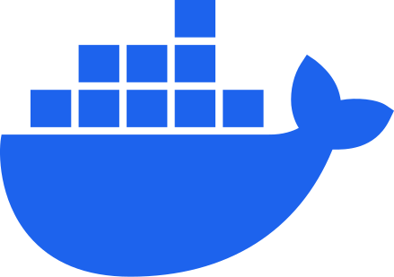
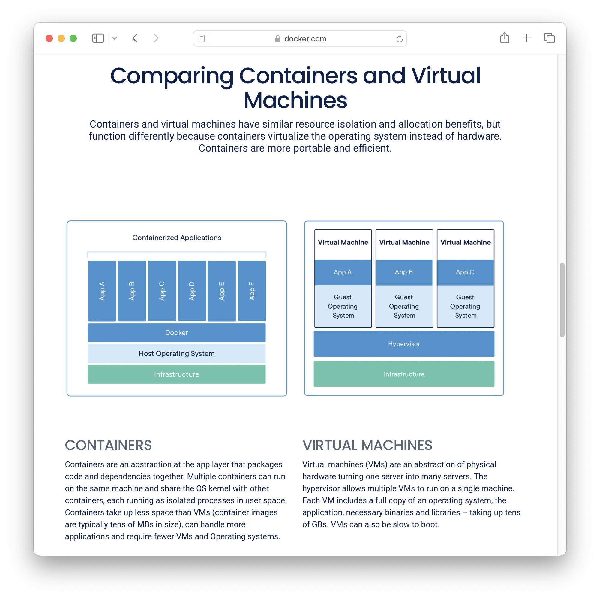
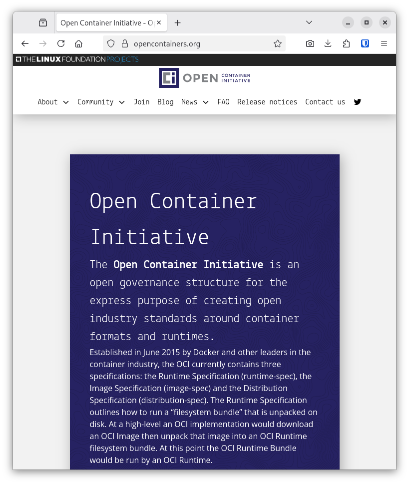
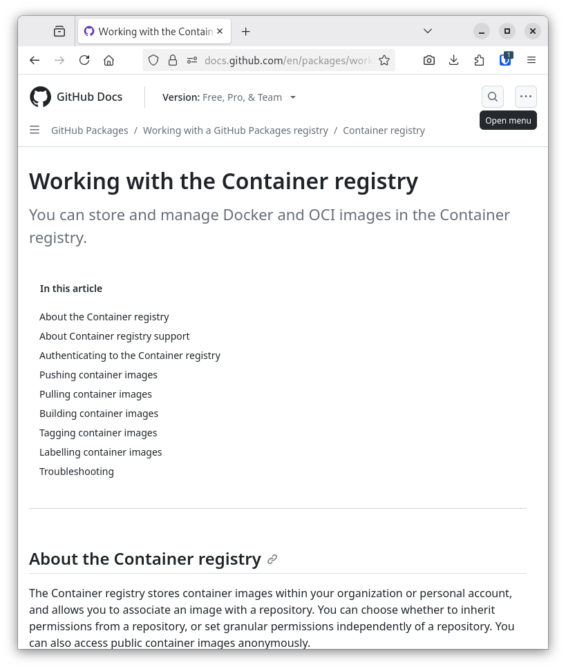
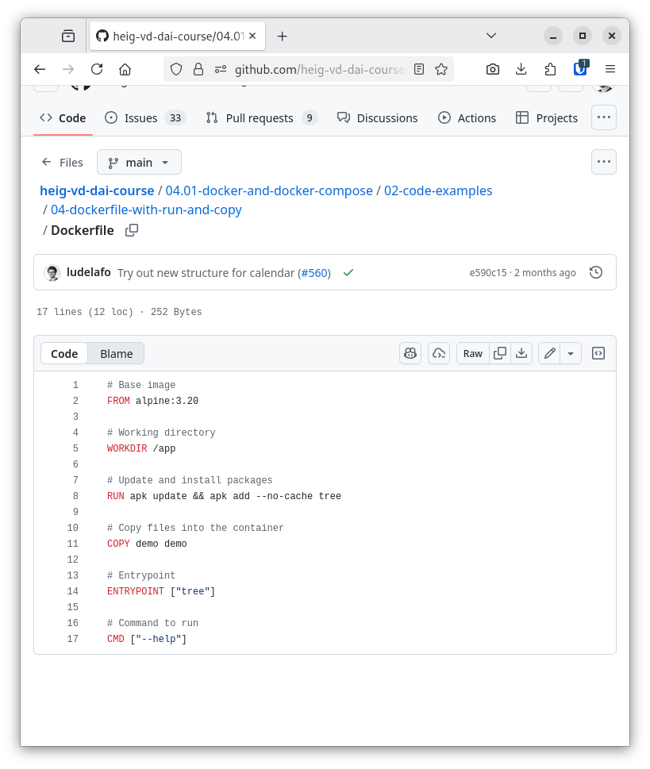
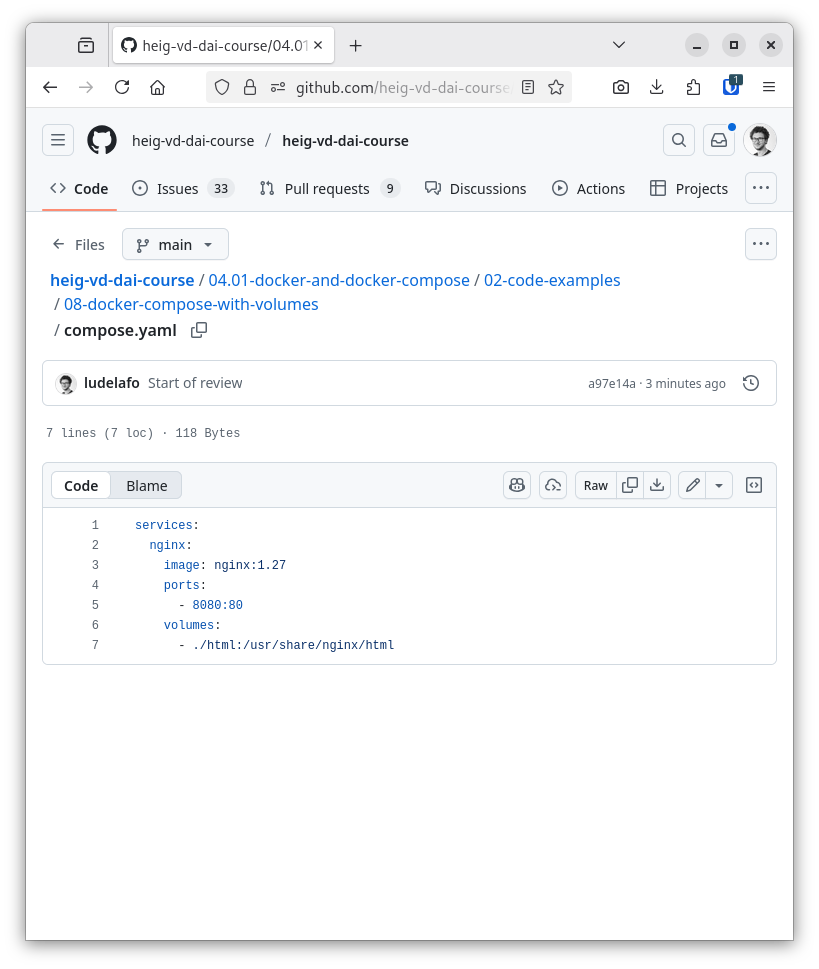

## Objectives

::: {.columns}
::: {.column width="55%"}
- Differences between bare metal, virtualization and containerization.
- How the OCI specification defines images, containers and registries.
- Use Docker and Docker Compose to **build, publish and run** applications
  in containers.
:::
::: {.column width="45%"}

:::
:::

# Setup

## Install Docker and Docker Compose

::: {.columns}
::: {.column width="60%"}
- Install Docker and Docker Compose.
- Configure Docker to:
  - run without `sudo` (root);
  - start automatically at boot.
- Details and per-OS instructions in the course material.
:::
::: {.column width="40%"}
{width="80%"}
:::
:::

## Code examples

- Check the code examples in `examples/05-docker/`.
- Run them alongside the theory.
- Modify them, play with them.

# Bare metal, virtualization and containerization

## Three ways to run software

{fig-align="center" height="500"}

## Bare metal

- The traditional way to run software.
- Software runs directly on hardware — full access.
- Fastest, but: no isolation, hard to maintain, hard to migrate.

## Virtualization

- Software runs in a **virtual machine**: a complete operating system.
- Isolated from the host.
- Heavy: slow to start, costly in disk and memory.

## Containerization

::: {.columns}
::: {.column width="55%"}
- Software runs in a **container**.
- Contains all dependencies of the application.
- Isolated from other containers.
- Lightweight: shares the host kernel, starts in seconds.
:::
::: {.column width="45%"}

:::
:::

# OCI: images, containers and registries

## The OCI specification

::: {.columns}
::: {.column width="55%"}
- **Image**: read-only template for creating containers.
- **Container**: running instance of an image.
- **Registry**: service storing images.
:::
::: {.column width="45%"}

:::
:::

## Registries

::: {.columns}
::: {.column width="55%"}
- **Docker Hub**: the default registry, millions of images.
- **GitHub Container Registry** (`ghcr.io`): images next to your code —
  used in this course.
:::
::: {.column width="45%"}

:::
:::

# Docker

## Docker

::: {.columns}
::: {.column width="60%"}
- Container engine (2013).
- Two parts:
  - **Docker daemon** — background service;
  - **Docker CLI** — `docker` command.
- Builds, runs and publishes containers.
:::
::: {.column width="40%"}
{width="70%"}
:::
:::

## Dockerfile

::: {.columns}
::: {.column width="55%"}
- Text file describing how to **build an image**.
- Starts from an existing base image (`FROM`).
- One instruction = one layer.
- Key instructions: `RUN`, `COPY`, `ENTRYPOINT`, `CMD`, `WORKDIR`.
:::
::: {.column width="45%"}

:::
:::

## Summary — Docker

- Docker = daemon + CLI.
- A **Dockerfile** builds a Docker **image**.
- An image creates **containers**: runnable, isolated instances.
- Code examples 01–05: Dockerfile basics → entrypoint/command → ports.

# Docker Compose

## Docker Compose

- Deploys a **multi-container application** (a *stack*).
- One YAML file: `compose.yaml` — committed to Git.
- Runs the stack on any Docker host.
- Much easier than plain `docker` commands.

## The Compose file

::: {.columns}
::: {.column width="55%"}
- **Services**: the containers of the stack.
- **Volumes**: shared directories to persist data.
- **Networks**: communication between services.
:::
::: {.column width="45%"}

:::
:::

## Summary — Docker Compose

- One `compose.yaml` describes the whole stack.
- `docker compose up` / `down` manage its lifecycle.
- Versioned and shared with the application.
- Old tutorials: `docker-compose` (v1, dead) → use `docker compose`.
- Code examples 06–09: basics → ports → volumes → environment variables.

# Docker networks

## Make containers communicate

- Containers are **isolated by default**.
- Compose connects services of a stack to a default network.
- Each container is reachable **by its service name** (built-in DNS).
- Custom networks connect containers across stacks.
- Code examples 10–11.

# Practical content

## What will you do?

Containerize the Java IOs project:

- Write the Dockerfile and Compose files.
- Publish on GitHub Container Registry.
- Run it on any Docker host.

## Now it's your turn!

- Read the course material.
- Do the exercises.
- Ask questions if you have any.

**Do not hesitate to help each other! There's no need to rush!**

## Questions?

Feedback on this chapter — what was easy, what was hard — is welcome in the
GitHub Discussions.

## Credits

::: {style="font-size: 0.7em"}
- Adapted from the
  [HEIG-VD DAI course](https://github.com/heig-vd-dai-course/heig-vd-dai-course)
  by L. Delafontaine and H. Louis — licensed
  [CC BY-SA 4.0](https://creativecommons.org/licenses/by-sa/4.0/),
  as is this deck.
- Main illustration by
  [CHUTTERSNAP](https://unsplash.com/photos/xewrfLD8emE) on Unsplash.
:::
